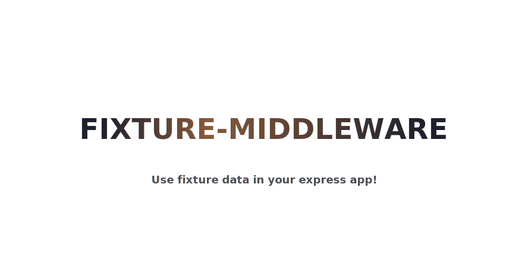

## Motivation

Sometimes I want to mock certain paths of my API made with [Express](http://expressjs.com/). Therefore, I created **fixture-middleware** which will use fixture data (mock) for any URL that matches a file inside the configured fixture directory.

## Installation

```shell
npm install fixture-middleware --save-dev
```

```shell
yarn add fixture-middleware --dev
```

## Usage

```js
const path = require('path')
const express = require('express')
const fixtureMiddleware = require('fixture-middleware')

const app = express()
const fixtureDirectory = path.resolve(__dirname, './fixtures')

app.use(fixtureMiddleware(fixtureDirectory))
```

### Matching URLs with fixture files

All URLs are normalized (all `/` will be replaced by `--`) and if a `Accept` headers is present it will be used to determine the file extension, otherwise the first matching file will be returned.

#### Example

Suppose we have the following files in the configured fixture directory:

```
`-- fixtures
    |-- users.json
    |-- users.html
    `-- users--active.json
```

The following request will match those files as follows

 | Request | Response
 | ---     | ---
 | **URL:** `/users` <br> **Headers:** (no accept header)               | **File:** `users.html` <br> **Headers:** `content-type=text/html`
 | **URL:** `/users` <br> **Headers:** `accept=application.json`        | `users.json`           <br> **Headers:** `content-type=application/json`
 | **URL:** `/users` <br> **Headers:** `accept=application.html`        | `users.html`           <br> **Headers:** `content-type=text/html`
 | **URL:** `/users/active` <br> **Headers:** (no accept header)        | `users--active.json`   <br> **Headers:** `content-type=application/json`
 | **URL:** `/users/active` <br> **Headers:** `accept=application.json` | `users--active.json`   <br> **Headers:** `content-type=application/json`

**Important:** Any unmatched request will be delegated to the next middleware.

## Development

  1. Clone and fork this repo.
  2. Install dependencies: yarn or npm install.
  3. [Run tests](#test).
  4. Prepare a pull request.

### Test

  - `yarn test` – to run all tests.
  - `yarn test -- --watch` – to run all tests in watch mode.

### Publish

  1. Bump package version: `yarn version --new-version x.x.x -m 'Version %s.'`.
  2. Publish to NPM registry: `npm publish`.
  3. Push new tag: `git push origin --tags`.

<div align=center>

Made with :heart: by [Rubens Mariuzzo](https://github.com/rmariuzzo).

[MIT license](LICENSE)

</div>
